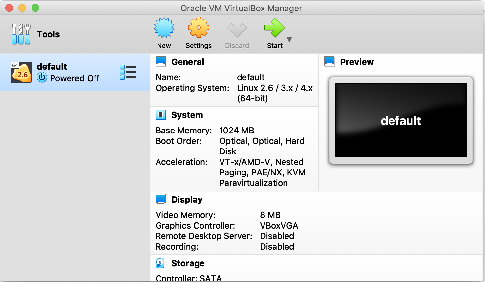
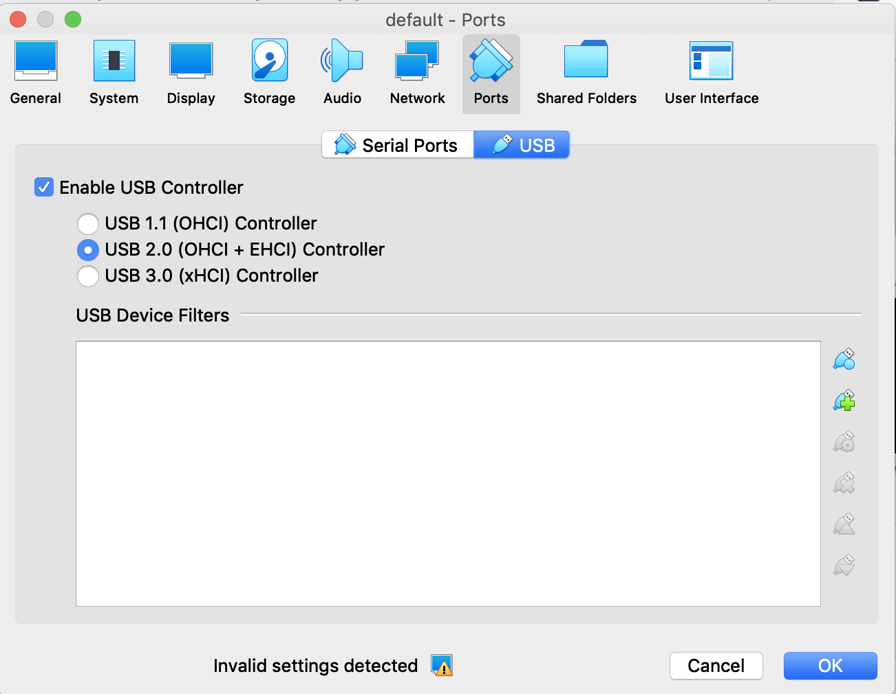
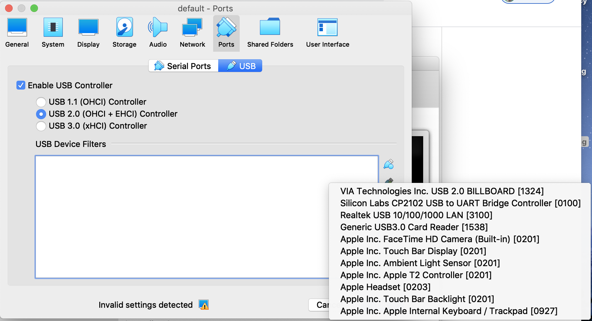

# Setup

## Installation Option One: Native

Install everything you need on your Mac workstation for C development in general, and ESP-IDF development specifically.

## Installation Option Two: Docker

We can code, build, test, flash, and monitor using Docker.  Flashing and monitoring requires docker to be run in privileged mode in order to access the serial port in the ESP-32 via USB 2.0.  Refer to the document [Using USB with Docker for Mac](https://dev.to/rubberduck/using-usb-with-docker-for-mac-3fdd), or just follow the instructions below:

### Install VirtualBox
- [Virtual Box Downloads Page](https://www.virtualbox.org/wiki/Downloads)
- [direct link to .dmg file](https://download.virtualbox.org/virtualbox/6.1.4/VirtualBox-6.1.4-136177-OSX.dmg)
- When installing the dmg there may be a security popup that does not allow the installation until allowed from Security & Privacy from System Preferences. The install will still say it couldn't complete, but should have completed and the VirtualBox application will appear in the Applications folder if installed in the default location.

### Install the VirtualBox Extension
You need the VirtualBox extension in order to tell your virtual machine to use USB 2.0.

- [Virtual Box Downloads Page](https://www.virtualbox.org/wiki/Downloads)
- [Direct link to the virtualbox extension](https://download.virtualbox.org/virtualbox/6.1.4/Oracle_VM_VirtualBox_Extension_Pack-6.1.4.vbox-extpack)

### Install DockerMachine
- follow install https://docs.docker.com/machine/install-machine/
  
  Or, just run this block in a terminal window:
  
  ```
  base=https://github.com/docker/machine/releases/download/v0.16.0 &&
  curl -L $base/docker-machine-$(uname -s)-$(uname -m) >/usr/local/bin/docker-machine &&
  chmod +x /usr/local/bin/docker-machine
  ```
This command curls the appropriate release based on what the `uname` command determines for your OS and software.
### Create virtual machine for running docker

```
docker-machine create -d virtualbox default
docker-machine stop
vboxmanage modifyvm default --usbehci on
```

If host-only adapter error is encountered you will be unable to continue. To fix this problem run `docker-machine rm default` and rerun the previous command string.

### Plug in your ESP-32

If you've never used and ESP-32 on your Mac workstation before, you need to install the [Silicon Labs CP210x USB to UART Bridge VCP Driver](https://www.silabs.com/products/development-tools/software/usb-to-uart-bridge-vcp-drivers).  Scroll down to the section `Download for Macintosh OSX`

Plug in your ESP-32 into a micro USB cable attached to your Mac workstation.  Verify the device is mounted

```
> ls -l /dev/cu.S*
crw-rw-rw-  1 root  wheel    9,   5 Feb 20 14:51 /dev/cu.SLAB_USBtoUART
```

If you don't see `/dev/cu.SLAB_USBtoUART`, then your device is not mounted.  Unplug the usb cable, plug it back in, wait a few seconds, and try again.

At this point, the ESP-32 is available on your mac hardware, but it's not available to the virtual box that is running under docker.  Let's fix that.

### Configure the USB driver in VirtualBox

 - verify your virtualbox image is stopped:
 
 ```
 docker-machine stop
 ```
 
 Run the virtual box application.  Verify the image `default` is stopped
 

 
- Click `Settings`, then `ports`, then USB
- Verify you see this screen:



Add your device by clicking the `edit plus` icon to the right of the `USB Device Filters` box:



- Select `Silicon Labs CP2102 USB to UART Bridge Controller`
- Click `OK` to save the filter
- Start docker-machine:

```
docker-machine start
eval $(docker-machine env default)
```

Let's verify that docker-machine is running and active:

```
> docker-machine ls
NAME      ACTIVE   DRIVER       STATE     URL                         SWARM   DOCKER     ERRORS
default   *        virtualbox   Running   tcp://192.168.99.102:2376           v19.03.5   
```

- Verify the `STATE` is `Running`, and `ACTIVE` is starred.

Now that we have the SiLabs driver configured to VirtualBox, it is no longer available to the Mac's bare metal:

```
> ll /dev/cu.S*
ls: /dev/cu.S*: No such file or directory
```

Note also that stopping the VirtualBox using `docker-machine stop` makes the driver once-again available to the Mac's bare metal.

At this point you are all set to use the build tools under docker for coding, testing, building, flashing, and monitoring the ESP-32.  Let's verify that this is true.

## Verifying Docker Setup

- Open a terminal window and set the working directory to this tutorial's project root.
- Run the script `./vmDockerDev.sh`.
- Verify the output:
```
Stopping "default"...
Machine "default" is already stopped.
Starting "default"...
(default) Check network to re-create if needed...
(default) Waiting for an IP...
```
- Note that it may take some time to get the IP.  Wait until you see:

```
Stopping "default"...
Machine "default" is already stopped.
Starting "default"...
(default) Check network to re-create if needed...
(default) Waiting for an IP...
Machine "default" was started.
Waiting for SSH to be available...
Detecting the provisioner...
Started machines may have new IP addresses. You may need to re-run the `docker-machine env` command.
Adding ESP-IDF tools to PATH...
Checking if Python packages are up to date...
Python requirements from /opt/esp/idf/requirements.txt are satisfied.
Added the following directories to PATH:
  /opt/esp/idf/components/esptool_py/esptool
  /opt/esp/idf/components/espcoredump
  /opt/esp/idf/components/partition_table/
  /opt/esp/tools/xtensa-esp32-elf/esp-2019r2-8.2.0/xtensa-esp32-elf/bin
  /opt/esp/tools/xtensa-esp32s2-elf/esp-2019r2-8.2.0/xtensa-esp32s2-elf/bin
  /opt/esp/tools/esp32ulp-elf/2.28.51-esp-20191205/esp32ulp-elf-binutils/bin
  /opt/esp/tools/esp32s2ulp-elf/2.28.51-esp-20191205/esp32s2ulp-elf-binutils/bin
  /opt/esp/tools/cmake/3.13.4/bin
  /opt/esp/tools/openocd-esp32/v0.10.0-esp32-20191114/openocd-esp32/bin
  /opt/esp/python_env/idf4.1_py3.6_env/bin
  /opt/esp/idf/tools
Done! You can now compile ESP-IDF projects.
Go to the project directory and run:

  idf.py build

root@a3b2ae8ff01e:/workdir# 
```

At this point you are inside of a docker container with access to the ESP-IDF toolchain and the necessary tools for C / C++ development.

If you didn't get that far, please review the [Setup](../step-0-setup/README.md) instructions.

You can exit the docker container and return to your host terminal by executing the `exit` command.

Proceed to [Step 1:  Getting Started](../step-1-getting-started/README.md)
